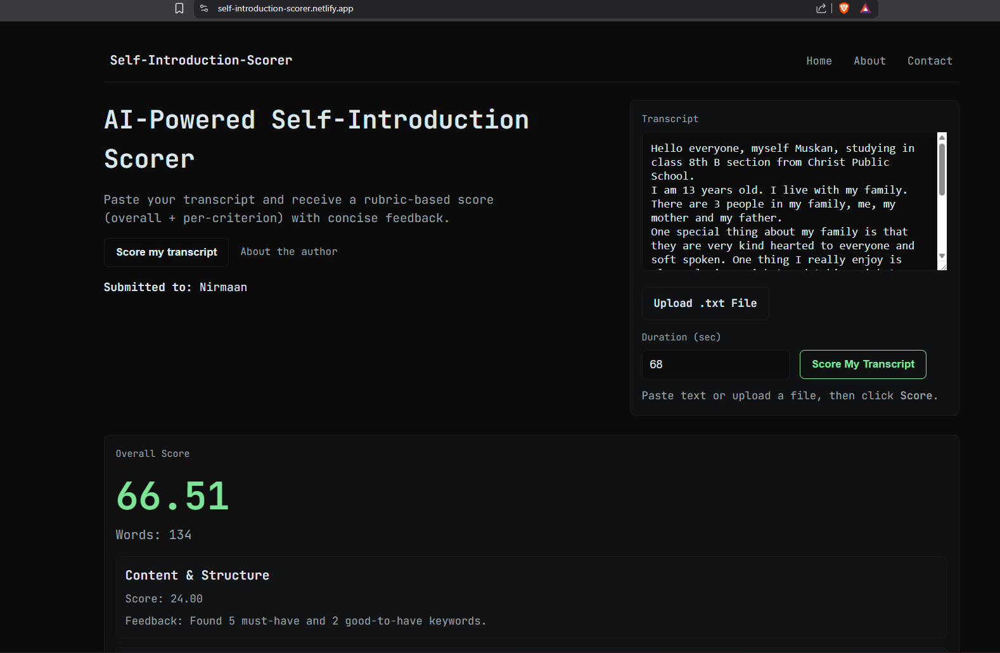

# Self-Introduction Scorer



A full-stack web application that evaluates a student's
self-introduction transcript using a structured scoring rubric. The
system combines rule-based logic, NLP-based analysis, and weighted
scoring to produce a final score and detailed criterion-wise feedback.

This project was built as part of the Nirmaan AI Intern Case Study.

## Live Application

-   Frontend: https://self-introduction-scorer.netlify.app/
-   Backend API: https://self-introduction-scorer.onrender.com/score
-   API Documentation:
    https://self-introduction-scorer.onrender.com/docs

## Overview

The Self-Introduction Scorer analyzes an uploaded or pasted transcript
and evaluates it across five major communication criteria:

1.  Content and Structure
2.  Speech Rate
3.  Language and Grammar
4.  Clarity
5.  Engagement

The system returns:

-   An overall score between 0 and 100
-   Scores for each criterion
-   Actionable feedback tailored to the student's transcript

The scoring engine uses a mix of keyword checks, spelling analysis,
sentiment evaluation, and filler-word detection to produce meaningful
results.

## Features

### Input and Interaction

-   Supports direct text input and optional speech duration.
-   Clean, responsive interface based on a dark themed layout.

### Scoring Engine

-   Rule-Based Checks
    -   Keyword detection\
    -   Filler word frequency analysis
-   NLP-Based Processing
    -   Spelling evaluation via `pyspellchecker`\
    -   Positivity and sentiment scoring via VADER
-   Weighted Scoring
    -   Each criterion has a configurable maximum score and weight\
    -   The system normalizes raw scores and computes a weighted sum

### Deployment

-   Frontend deployed on Netlify\
-   Backend hosted on Render using a Python-native environment

## Scoring Formula

Each criterion produces a raw score based on its rules. The raw score is
normalized:

    normalized_score = raw_score / max_score_for_criterion

The normalized value is then multiplied by the criterion weight. Summing
all weighted contributions gives the final score.

Example:\
- Raw clarity score: 12 out of 15\
- Normalized: 12 / 15 = 0.8\
- Weight: 15 percent\
- Contribution: 0.8 × 15 = 12 points

## Tech Stack

### Backend

-   FastAPI\
-   Python\
-   pyspellchecker\
-   vaderSentiment\
-   Uvicorn

### Frontend

-   HTML5\
-   CSS3\
-   JavaScript

### Deployment

-   Netlify (static frontend)\
-   Render (FastAPI backend)

## Project Structure

    self-introduction-scorer/
    ├── backend/
    │   ├── app/
    │   │   ├── main.py               # API routes
    │   │   ├── models.py             # Pydantic models
    │   │   ├── scoring/
    │   │   │   ├── scoring.py        # Scoring logic
    │   │   │   └── scoring_config.py # Rubric configuration
    │   └── requirements.txt
    └── frontend/
        ├── index.html
        ├── style.css
        └── script.js

## Local Setup

### Requirements

-   Python 3.10 or higher\
-   Git

### 1. Clone the Repository

``` bash
git clone https://github.com/DurvankGade/self-introduction-scorer.git
cd self-introduction-scorer
```

### 2. Backend Setup

``` bash
cd backend

python -m venv venv
source venv/bin/activate    # Windows: venv\Scripts\activate

pip install -r requirements.txt

uvicorn app.main:app --reload
```

### 3. Frontend Setup

``` bash
cd frontend
python -m http.server 8001
```

Update `API_URL` in `script.js` for local testing if needed.

## Deployment Notes

The initial version used `language-tool-python`, which depends on a Java
Runtime Environment. Render's free Python environment does not include a
JRE. Dockerization was attempted but exceeded free tier memory.

To ensure stable deployment, `language-tool-python` was replaced with
`pyspellchecker`, removing heavy dependencies and ensuring compatibility
with Render's limitations.

## License

MIT License

## Author

Durvank Gade\
GitHub: https://github.com/DurvankGade\
LinkedIn: https://linkedin.com/in/durvank-gade

## Submission

Submitted for the Nirmaan AI Intern Case Study.
